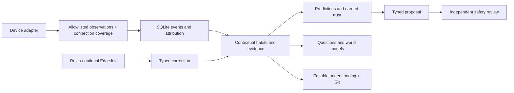

# Framework architecture and adapter contract

Moqi is an experimental home-agent memory and learning framework. It accepts observations, learns from attributed behavior and produces auditable shadow predictions. It currently has no device-execution API.

## Public API

`HomeMemory(config, database)` owns a validated configuration and a SQLite store. `Observation` describes an entity, timezone-aware event time, state, previous state, optional attributes, source and attribution evidence. See `examples/adapter.py`.

Non-Python adapters use the JSON shape in `examples/observation.json`. `Observation.from_dict` validates `schema_version: 1`, required fields, timezone-aware ISO time, known source labels, attribute objects, finite JSON values and payload size. Unsupported fields/versions are rejected rather than guessed.

- `ingest(observation)` records an allowlisted event and returns whether it was new. Identical canonical events deduplicate. Changing the attribution of an existing event uses `Store.annotate`, with an audit note, rather than re-ingestion.
- `observe_interval(start, end)` declares verified continuous adapter observation coverage. This is not room occupancy. Gaps must remain gaps; false coverage manufactures false negative opportunities.
- `learn(at)` consolidates evidence through an explicit event-time boundary. It does not generate a Git commit. Use the CLI `reflect` for full local L3 export and versioning.
- `predict(at)` issues shadow forecasts; it writes a forecast ledger. Unlike `inspect(at)`, this is not a read-only operation.
- `inspect(at)` returns learned evidence and summaries. Queries cannot pretend that later-trained memory existed in the past; chronological evaluation requires a separate replay database.

The API is pre-1.0. Stable published compatibility is not claimed. SQLite schema version 1 recognizes the prior unversioned schema through additive migrations and refuses future schema versions. Schema-changing releases must include migration notes and persistence tests. The first public release does not yet have a general migration framework for arbitrary future revisions.

## Attribution

Sensors provide observations, not human actions. An actuator change defaults to `unknown`. `human` and `device` labels require an explicit evidence note; the framework cannot verify the physical truth of an adapter's claim. Baselines, unavailable devices and removed states cannot be asserted as attributed human actions. Home Assistant's `user_id` alone is not proof of a human.

Adapters should document physical button feedback, pre-existing automation, agent echoes, missing coverage, state units and available metadata. The HA client subscribes before obtaining a baseline, handles interleaved events, and reads state only. Cameras and images are excluded.

## Memory and learning

- Raw events and contexts expire after 30 days; numerical downsampling and compact evidence survive.
- Episodes use explicitly configured home/sleep boundaries. Motion stopping does not prove absence.
- Four verified occurrences in 14 days can create a candidate; this is not permission to execute.
- Exposure-based forgetting discounts evidence when the relevant context appears, not just because days pass. Missing contexts can become dormant.
- Earned trust uses shadow and execution-feedback evidence separately. A simulated receipt demonstrates mechanics, not real authorization.
- Versioned understanding can be restored while observations, execution receipts, human leases and speech budgets remain operational facts.

The Python core implements these mechanisms. The browser uses the same source files and SQLite under Pyodide, not a second JavaScript learning algorithm. Browser checkpoints are session-only memory snapshots; local L3 versioning uses Git. They share the memory-table restore operation, but have different storage and persistence.

## Language and safety

Rules accept a bounded Chinese correction grammar. EdgeJev is optional and reads local model files. Model-only interpretations remain explicit-acceptance candidates until home-domain calibration. Numeric/time comparisons and device safety do not depend on language-model confidence.

The safety reviewer has no HA service-call capability. Real execution, audio acquisition/playback, hardware latency and energy results remain future acceptance gates. Mandatory announcements conflict with both nighttime silence and the daily speech budget in the original plan; these require a resolved policy before physical execution.

## Dependency and privacy boundaries

The browser loads the pinned Pyodide runtime and timezone data from a CDN; other than those startup downloads, its simulation makes no server requests. Inputs stay in browser session memory. Closing/reloading loses that sandbox. Downloaded evidence exports remain the visitor's responsibility.

HA tokens belong in process environment variables. Models, household databases, `.env`, HA configuration, raw audio and private deployment history are not public repository assets. The repository preparation tool copies only an explicit list of source/example/documentation files.

Package dependencies are declared in `pyproject.toml`. Core import does not authenticate to HA or initialize EdgeJev. It retains the existing lightweight WebSocket dependency for deployment compatibility; splitting installation extras is a later compatibility decision.
